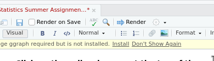
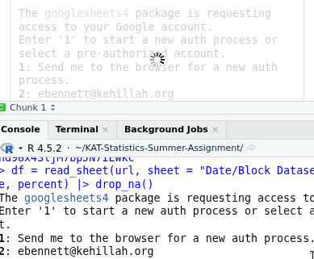

# Quarto

Quarto enables you to weave together content and executable code into a finished document. To learn more about Quarto see <https://quarto.org>.

# 1. Install the libraries

R is a programming language. It's useful for general-purpose tasks.

Other people on the internet have added fancy special-purpose features.

RStudio will go download those special-purpose features from the internet for you.

**Click on the yellow banner at the top of the page where it says "Install".**



You only have to do this once.

# 2. Load the libraries

The gray box below is a code box. It has some code you need to run so R knows you want to use the libraries you installed.

**Click on the greed triangle in the upper right corner of the code box.**

You have to do this again every time you open up RStudio!

```{r message=FALSE}
library(tidyverse)
library(googlesheets4)
```

# 3. Look at the data

Copy-paste this link into a web browser (e.g. Chrome, Safari, Firefox): <https://docs.google.com/spreadsheets/d/1lYL1TvyNuLsGGCRR016CLqnd98x43ljM7bpJN7IEWkc>.

This is data from 3 years ago. We will look at the "Date/Block Dataset" tab, which (among other things) shows what scores students got on MCQ (multiple choice question) quizzes and what scores students got on FRQ (free response question) quizzes.

# 4. Load the data into RStudio

The code box below reads the spreadsheet from Google Drive.

**Click on the greed triangle in the upper right corner of the code box. THERE WILL BE NO OUTPUT: KEEP READING!!!**

```{r}
url = "https://docs.google.com/spreadsheets/d/1lYL1TvyNuLsGGCRR016CLqnd98x43ljM7bpJN7IEWkc"
df = read_sheet(url, sheet = "Date/Block Dataset") |> select(quiz_type, percent) |> drop_na()
```

A prompt will show up at the bottom of the screen. It will ask you how you want to log in. Tell it "1" for "Yes" to start caching OAuth or, if that's already done, "Send me to the browser for a new auth process".



Then log in online using your Kehillah Google account. Make sure to check boxes for all the permissions, if it asks.

# 5. Extract the FRQ and MCQ scores

The code below will extract the FRQ scores and MCQ scores into variables that we can use later.

**Click on the greed triangle in the upper right corner of the code box.**

```{r}
frq_scores = df |> filter(quiz_type == "FRQ") |> pull(percent)
mcq_scores = df |> filter(quiz_type == "MCQ") |> pull(percent)
```

# 6. Calculate the average FRQ score

Run the code box below. It will tell you that the average FRQ score was about 64%.

```{r}
mean(frq_scores)
```

# 7. Calculate the average MCQ score.

Edit the code block box below so it's like the one from step 6, but this time for the `mcq_scores` and then run it. It will tell you that the average MCQ score was about 73%.

```{r}
mean(mcq_scores)
```

# 8. Graph the FRQ scores

Run the code below. It will make a histogram plot of the FRQ scores.

```{r}
hist(frq_scores)
```

# 9. Graph the MCQ scores

Edit the code block box below so it's like the one from step 8, but this time for the `mcq_scores` and then run it.It will make a histogram plot of the MCQ scores.

```{r}
hist(mcq_scores)
```

# 10. Send me your code

1.  Save this file.

2.  In the top menu bar, go to Tools \> Version Control \> Commit...

3.  Check the box next to the filename "KAT Statistics Summer Assignment.qmd"

4.  In the box labeled "Commit message", type "Analyze MCQ data"

5.  Click the "Commit" button

6.  In the top menu bar, go to Tools \> Version Control \> Push Branch

7.  Input your "Personal Access Token" from Github (repeat the instructions to make a new token if you have lost the one you already made)
